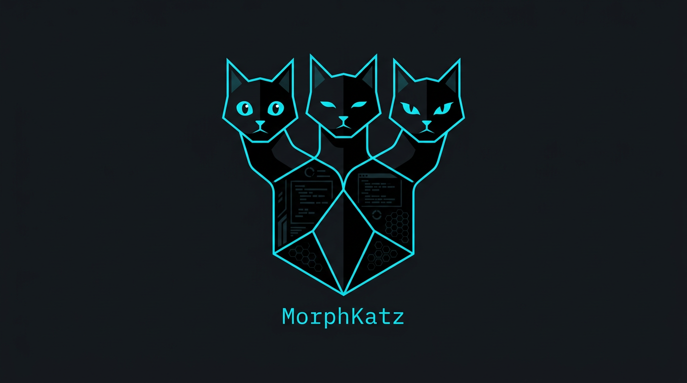
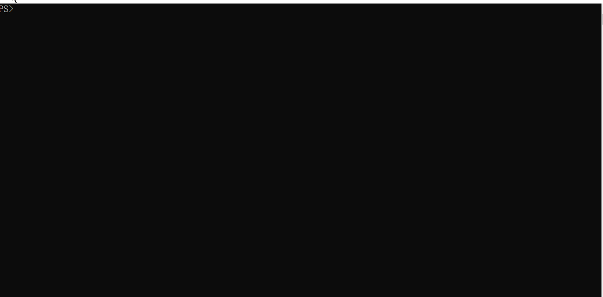

<p align="center">
  
</p>

<h1 align="center">MorphKatz</h1>

<p align="center">
  <b>Windows x64 polymorphic machine-code rewriter.</b><br>
  <i>N faces, one body.</i> One static <code>morphkatz.exe</code> that rewrites
  PE binaries into semantically identical but byte-different variants.
</p>

<p align="center">
  <a href="#who-its-for">Who it's for</a> &middot;
  <a href="#quick-start">Quick start</a> &middot;
  <a href="#architecture--benchmarks">Architecture</a> &middot;
  <a href="#writing-your-own-rewrite-rules">Rule schema</a> &middot;
  <a href="#responsible-use">Responsible use</a> &middot;
  <a href="#licensing">Licensing</a>
</p>

<p align="center">
  <a href="CONTRIBUTING.md">Contributing</a> &middot;
  <a href="SECURITY.md">Security</a> &middot;
  <a href="TELEMETRY.md">Zero telemetry</a> &middot;
  <a href="TRADEMARK.md">Trademark</a>
</p>

---

MorphKatz rewrites x86-64 machine code inside PE executables and raw shellcode
into **semantically identical but byte-different** equivalents. Same arithmetic,
same observable EFLAGS effects, same control-flow — different bytes. That
breaks byte-pattern detection (YARA rules, Defender signatures, Elastic rules,
Sigma detection content) without changing what the code actually does.

## Live Demo

<p align="center">
  
</p>

> Scan → **detected** (`HackTool:Win32/AmDisable!MTB`) → morph with `--data-morph on` → scan again → **clean** → run → bypass still works at runtime.

## Who it's for

MorphKatz is built for **two complementary audiences**, and we treat both as
first-class:

### 🛡️ Detection engineers / Blue team

If your job is to write YARA rules, Defender custom indicators, Elastic
detection content, or Sigma rules, MorphKatz tells you **how durable each rule
actually is**. Pipe one of your malware samples through MorphKatz with
`--variants 50` and `--target your-yara/*.yar` and you get back, per rule, the
percentage of variants on which it still triggers. Rules that fall off a
cliff under polymorphic mutation are the ones an evolving threat actor will
silence first; you want to harden those before the actor does.

Specific Blue-team workflows:

- **Detection-engineering coverage testing** — quantify "what % of my rules
  are one equivalent-swap away from silence?".
- **Signature triage** — see exactly which bytes in a PE drove a Defender
  detection (`morphkatz scan --bisect`), and use that to harden or generalise
  the rule.
- **Polymorphic-robust classifier training** — generate diverse but
  semantically identical training data for ML malware classifiers.
- **Binary-similarity research** — generate evaluation corpora with known
  ground truth (every variant shares the same source semantics).

### 🗡️ Red team / Authorised offensive research

If you're testing detection coverage from the offensive side under a clear
rules-of-engagement paper trail, MorphKatz turns "manually rewrite five
gadgets and recompile" into a rules-of-engagement-friendly automation:

- **Rules-of-engagement-friendly evasion** — every mutation is rule-cited from
  the Intel SDM, every run is reproducible from `--seed`, every change lands
  in a JSON / HTML diff report you can drop into the engagement deliverable.
- **Reproducibility for your write-up** — same seed, same input, byte-for-byte
  identical output, on any machine.
- **Author-audited rules only** — MorphKatz refuses to ship pop-malware-of-
  the-month rule packs. Every rule has a cited semantic-equivalence proof in
  its YAML.

What MorphKatz is **not**:

- ❌ A live-malware obfuscator. We deliberately do not target the
  pop-malware-of-the-month list — see [`RESPONSIBLE_USE.md`](RESPONSIBLE_USE.md).
- ❌ A behavioural / ML-evasion tool. MorphKatz mutates *bytes* with
  preserved semantics; ML detections (anything ending in `!ml`) evaluate
  global behaviour and won't budge — that class of evasion is out of
  scope.
- ❌ A black box. Every rule's equivalence proof, every diff report's
  metric, every byte changed is yours to audit.

## Features

- **CFG-aware disassembly** — Zydis-powered recursive descent with
  jump-table recovery; data-in-code regions are never accidentally
  decoded.
- **In-process encoding** — Zydis encoder generates patched
  instructions in the same address space, zero IPC overhead.
- **YAML rule packs** — every rewrite rule lives under `rules/x64/`,
  reviewable and hot-swappable. Add your own without recompiling.
- **Typed intermediate representation** — `ir::Instruction` carries
  full Zydis operand metadata through the entire rewrite pipeline.
- **EFLAGS liveness** — full effect model (AF/CF/OF/PF/SF/ZF) with
  per-basic-block dataflow so rewrites never corrupt flag state.
- **Seeded polymorphism** — `xoshiro256**` RNG; `--seed N` gives
  byte-for-byte reproducible output on any machine.
- **Intel SDM NOP padding** — 1..9-byte multi-byte NOP rotation drawn
  from the Intel Optimization Reference Manual.
- **Semantic verification** — re-disassembly check by default;
  optional Unicorn basic-block emulation (`--verify unicorn`).
- **YARA-aware targeting** — `--target rules.yar` prioritises rewrites
  that break specified signature atoms.
- **Defender feedback loop** — `--target-defender` runs MpCmdRun,
  bisects anchors, and feeds them into the priority queue automatically.
- **Data-section morphing** — `--data-morph on` XOR-encodes
  signature-bearing byte sequences in `.rdata` / `.data` and decodes
  them at runtime via a polymorphic stub with an anti-emulation gate.
- **JSON + HTML reports** — per-offset before/after diffs, rule IDs,
  and detection-coverage metrics.
- **PE hygiene** — `CheckSumMappedFile`, Authenticode strip,
  reproducible timestamp, Rich-header `preserve|strip|randomize`.
- **Single static binary** — one `morphkatz.exe`, no runtime
  dependencies.

## Quick start

### Prerequisites

- **Windows 10+** / Windows Server 2019+, x64.
- **Visual Studio 2022 17.8+** with "Desktop development with C++" and the
  MSVC v143 toolset.
- **CMake 3.27+** (bundled with recent VS installers).
- **[vcpkg](https://github.com/microsoft/vcpkg)**:
  ```powershell
  git clone https://github.com/microsoft/vcpkg
  .\vcpkg\bootstrap-vcpkg.bat
  [Environment]::SetEnvironmentVariable('VCPKG_ROOT', (Resolve-Path .\vcpkg), 'User')
  ```

### Build — classic Visual Studio `.sln` (one-click)

MorphKatz does **not** commit `.sln` / `.vcxproj` files — they are generated
from `CMakeLists.txt` on demand so target wiring, include dirs, and vcpkg
linkage stay authoritative in one place. For the classic "double-click the
.sln" experience:

```powershell
.\Open-in-VS.cmd                            # default: preset vs2022-x64
.\Open-in-VS.cmd -Preset vs2022-x64-asan    # ASan build
.\Open-in-VS.cmd -Fresh                     # nuke CMake cache first
.\Open-in-VS.cmd -NoOpen                    # configure only; for CI / scripting
```

`Open-in-VS.cmd` (a thin wrapper over `scripts\open-in-vs.ps1`) checks
`VCPKG_ROOT`, runs the CMake VS generator, and launches the generated
`build\<preset>\MorphKatz.sln` in the matching Visual Studio install
(located via `vswhere`). Once open, set `morphkatz` as the startup project
and hit F5.

Equivalent manual flow:

```powershell
cmake --preset vs2022-x64
start build\vs2022-x64\MorphKatz.sln
```

### Build — VS 2022 "Open Folder" / CMake mode

```powershell
# In Visual Studio: File > Open > Folder... -> (this repo)
# Select the vs2022-x64 configuration, hit F5.
# `.vs\launch.vs.json` is pre-wired with --version / --help / dry-run targets.
```

### Build — CLI only (Ninja)

```powershell
cmake --preset ninja-x64-release
cmake --build --preset ninja-x64-release
ctest --preset ninja-x64-release --output-on-failure

.\build\ninja-x64-release\morphkatz.exe --version
```

### Presets

| Preset              | Purpose                                                |
|---------------------|--------------------------------------------------------|
| `vs2022-x64`        | Emits `MorphKatz.sln` + `.vcxproj`. Default developer workflow. |
| `vs2022-x64-asan`   | Same, with MSVC `/fsanitize=address`.                  |
| `ninja-x64-release` | CLI Release build. CI-fast.                            |
| `ninja-x64-debug`   | CLI Debug build.                                       |
| `clang-cl-asan`     | `clang-cl` with ASan + UBSan. CI fuzzing.              |

## Usage

### First-run / bare-invocation

Double-clicking `morphkatz.exe` or running it with no arguments prints
a compact banner and the top five examples — no silent crash, no empty
help dump:

```text
           /\_/\      /\_/\      /\_/\
          ( o.o )    ( -.- )    ( ^.^ )
           > ^ <      > ^ <      > ^ <
              \_________|_________/
                        |
                     [  PE  ]

               M o r p h K a t z

   N faces, one body - polymorphic PE rewriter (Windows x64)
               Coded by Mohammed Abuhassan

Usage:  morphkatz <input> [options]
        morphkatz compare <a> <b> [more...] [--report out.json]
        morphkatz scan    <input> [--bisect] [--report out.html]

Quick start:
  morphkatz payload.exe --seed 42 --report report.html
  morphkatz payload.exe --seed 1 --variants 8 --report batch.json
  morphkatz target.exe  --target yara/*.yar -vv
  morphkatz target.exe  --target-defender target.exe --report run.html
  morphkatz compare v0.exe v1.exe --report cmp.html
  morphkatz scan suspect.exe --bisect --report scan.json

Run 'morphkatz --help'         for all options.
Run 'morphkatz compare --help' for the comparison subcommand.
Run 'morphkatz scan --help'    for Defender scanning options.
Run 'morphkatz --version'      for build info.
```

### Full option surface

```text
morphkatz <input.exe|input.bin> [options]

Input/output:
  -o, --output <path>            Default: <input>.patched.<ext>    (foo.exe -> foo.patched.exe)
      --backup                   Write <input>.bak (default on)
      --in-place                 Overwrite input (requires --no-backup)

Modes:
      --profile {safe,normal,aggressive}    Default: normal
      --target <rules.yar>                  Prioritise rewrites that break these YARA rules
      --rules <dir|file>                    Load custom YAML rule packs

Polymorphism:
      --seed <u64>               Reproducible run
      --mutation-budget <N>      Max rewrites per basic block
      --variants <N>             Emit N deterministic morphs (1..1000);
                                 outputs go to <output>_v<i>.<ext> plus a
                                 rolled-up <report>.summary.json

Verification:
      --verify {none,redisasm,unicorn}       Default: redisasm
      --verify-timeout-ms <N>    Default: 5000

PE options:
      --fix-checksum             Default on
      --strip-signature          Default off, warn if present
      --reproducible-timestamp <unix>           Default: keep original
      --rich-header {preserve,strip,randomize}  Default: preserve

Reporting:
      --report <path.json|path.html>
      --dry-run                  No file write; report-only
      --stats                    Print aggregate counts
  -v, --verbose                  Repeatable (-v, -vv, -vvv)
      --log-file <path>

Detection feedback:
      --target-defender <reference.exe>
                                 Run the deployed Microsoft Defender
                                 against <reference.exe> (Tier-1, via
                                 MpCmdRun.exe), peel every byte
                                 anchor with multi-anchor bisection,
                                 and feed them into the rule matcher
                                 priority alongside --target. Adds a
                                 `defender:` block to the report.
                                 See docs/scan.md.
      --auto-yara,--no-auto-yara
                                 When --target-defender flags a
                                 known family (e.g. Mimikatz), auto-
                                 load the bundled YARA hint pack at
                                 rules/yara/x64/<family>.yar so the
                                 rule matcher can boost candidates
                                 that touch family-specific bytes.
                                 Default: on. Ignored when --target
                                 is set explicitly. See
                                 rules/yara/README.md.

Data-section morphing:
      --data-morph {off|plan|on}
                                 Mutate signature-bearing byte
                                 sequences in .rdata / .data by
                                 XOR-encoding them on disk and
                                 decoding them at runtime via an
                                 appended .morph section. Default
                                 off; 'plan' is a read-only dry
                                 run that lists the atoms in the
                                 report. See docs/data-morph.md.
                                 --target-defender auto-escalates
                                 to 'on' when bisect anchors land
                                 in .rdata or .data and --data-morph
                                 wasn't pinned by the user.
      --decoder-placement {auto|ep-thunk|tls-callback}
                                 Where the runtime decoder lives.
                                 'auto' (default) prefers TLS
                                 callbacks when feasible, falls back
                                 to an entry-point thunk otherwise.
      --data-morph-min-len <bytes>      Default 4
      --data-morph-max-len <bytes>      Default 4096
                                 Length filter on candidate atoms.

Subcommands:
  morphkatz compare <a> <b> [c...] [--report out.json|out.html]
      Pairwise diff of 2+ binaries: aligned Hamming %, byte-histogram
      cosine, alphabet Jaccard, SHA-256, entropy. Useful for checking
      that --variants actually produced diverse outputs.

  morphkatz scan <input> [--bisect] [--bisect-mode {single|all}] \
                         [--bisect-scope {sections|sections-all|code|data|raw}] \
                         [--report out.json|out.html]
      Run Microsoft Defender (Tier-1, MpCmdRun-backed) against a
      single file. With --bisect, isolate the offending byte
      window(s); --bisect-mode all peels every anchor via
      multi-anchor bisection so signatures like Mimikatz!pz that
      span multiple regions are fully enumerated. --bisect-scope
      controls the PE-aware mask: 'sections' (default) keeps the
      buffer parseable on every iteration by masking only inside
      section payloads minus data-directory windows. See docs/scan.md.
```

### Batch + compare example

```powershell
# Emit 8 deterministic morphs and roll up a summary.
morphkatz.exe payload.exe --seed 1 --variants 8 --report batch.json

# Inspect pairwise diversity.
morphkatz.exe compare payload_v0.exe payload_v1.exe payload_v2.exe
```

## Writing your own rewrite rules

Rules are YAML under `rules/`. See [`docs/rule-schema.md`](docs/rule-schema.md)
for the full schema. Minimal example:

```yaml
version: 1
rules:
  - id: x64.zero.xor_to_sub
    match:
      mnemonic: XOR
      operand_count: 2
      constraints:
        - { op: 0, kind: register, class: gpr }
        - { op: 1, kind: register, class: gpr }
        - { same_register: [0, 1] }
        - { register_blacklist: [RSP] }
    rewrite:
      mnemonic: SUB
      operands:
        - { copy_from: 0 }
        - { copy_from: 1 }
    flags_effect: equivalent
    size_delta: 0
    weight: 1.0
```

Drop your rule into `rules/x64/equivalence/` or pass `--rules path/to/my.yaml`.

## Architecture & benchmarks

- [`docs/architecture.md`](docs/architecture.md) — module map, end-to-end flow,
  design rationale.
- [`docs/benchmarks.md`](docs/benchmarks.md) — measurement plan; real
  numbers land when the MalwareBazaar-backed harness in
  [`docs/evasion_bench.md`](docs/evasion_bench.md) runs end-to-end.
- [`docs/roadmap.md`](docs/roadmap.md) — what's coming in v1.1
  (Auto-Discover) and v1.2.

## Private research

MorphKatz's data-section morphing and anti-emulation gate are backed by
original reverse-engineering research into Microsoft Defender's
`mpengine.dll` emulator internals and heuristic scoring model. This
research — covering emulator instruction budgets, heuristic trigger
conditions, and evasion-gate design — is maintained privately and is
**not included in this repository**.

If you are a security researcher interested in the technical details,
reach out via GitHub Issues or Discussions. We selectively share the
full research notes with verified security professionals, detection
engineers, and academic researchers on a case-by-case basis.

## Responsible use

MorphKatz is a defensive-security research tool for red-team engagements,
malware analysis training, and AV/EDR product evaluation. Use only on
binaries you own or are authorised to test. Read
[`RESPONSIBLE_USE.md`](RESPONSIBLE_USE.md) before shipping MorphKatz output at
anyone.

## Licensing

MorphKatz is licensed under the [GNU Affero General Public License v3.0
or later](LICENSE). Use it freely in research, open-source projects,
internal tooling, or on your own laptop. If you expose MorphKatz
behaviour as a network service, AGPL-3.0 §13 requires you to publish
your modifications.

Project-wide policy documents:

- [`CONTRIBUTING.md`](CONTRIBUTING.md) — DCO sign-off; CI enforces it
  on every PR.
- [`TELEMETRY.md`](TELEMETRY.md) — zero telemetry, documented and
  enforced.
- [`TRADEMARK.md`](TRADEMARK.md) — name and logo policy.
- [`SECURITY.md`](SECURITY.md) — coordinated disclosure, supported
  versions.
- [`NOTICE`](NOTICE) — third-party component licences (Zydis, LIEF,
  Unicorn, libyara, etc.).

## Contributing

Pull requests welcome — read [`CONTRIBUTING.md`](CONTRIBUTING.md) first.
In short: DCO sign-off on every commit (`git commit -s`), tests for new
rules, no `using namespace` in headers, `/W4 /permissive-` warnings are
errors.

## Security

For security vulnerabilities, use GitHub Security Advisories. **Do not**
file a public issue. See [`SECURITY.md`](SECURITY.md) for the
coordinated-disclosure timeline.

## Third-party libraries

MorphKatz stands on the shoulders of:

- **[Zydis](https://github.com/zyantific/zydis)** — disassembler +
  encoder fast enough to run on every instruction of a 10 MB binary.
- **[LIEF](https://github.com/lief-project/LIEF)** — PE parser that
  doesn't pretend the Windows loader is simple.
- **[libyara](https://github.com/VirusTotal/yara)** — rule engine whose
  AST is introspectable at compile time.
- **[Unicorn Engine](https://github.com/unicorn-engine/unicorn)** — the
  semantic-verification backend.
- **[vcpkg](https://github.com/microsoft/vcpkg)** — dependency
  management on Windows.

See [`NOTICE`](NOTICE) for the formal attribution manifest and full
third-party licence list.

---

<sub>This codebase grew out of an earlier Python research prototype
([Beatrice.py](https://github.com/raskolnikov90/Beatrice.py)). MorphKatz
is an independent C++20 reimplementation — different disassembler,
different encoder, different IR, external YAML rule packs, and many
engines (CFG recovery, EFLAGS liveness, Unicorn verify, YARA targeting,
data-section morphing, Defender feedback loop) that have no Python
counterpart. The targeted byte-pattern packs under
`rules/x64/targeted/` were ported from the prototype with the original
author's permission under MorphKatz's AGPL-3.0 licence.</sub>
