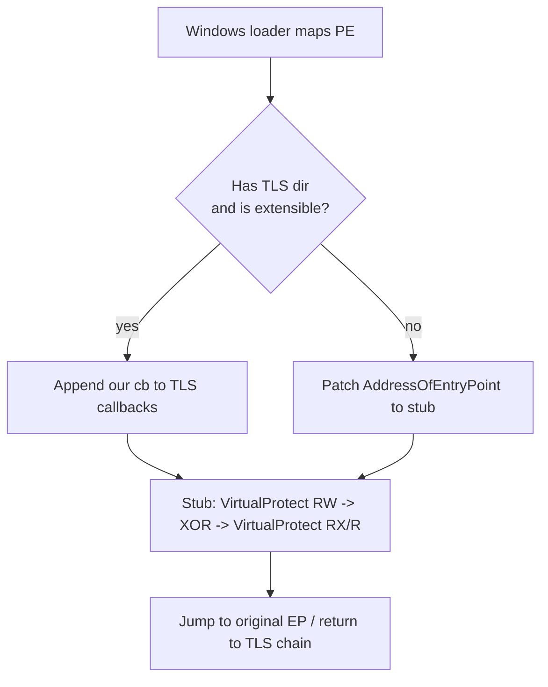
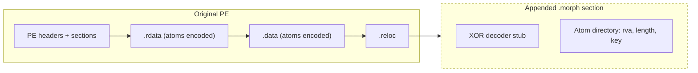

# `--data-morph` — Data-section morphing pass

Beyond MorphKatz's instruction-level rewriting in `.text`, the data-morph
pass mutates **signature-bearing byte sequences in non-executable
sections** (`.rdata`, `.data`) by encoding them on disk and decoding
them back at runtime, before the rest of the program ever runs.

This page documents the threat model, when to enable the pass, what
gets encoded, the runtime decoder placement decision, and known
limitations. For the broader Defender feedback loop see
[`docs/scan.md`](scan.md); for the orchestrator architecture see
[`docs/architecture.md`](architecture.md).

## Why we need this

Static AV signatures don't only live in code. The investigation
documented in internal research notes
showed that a textbook x64 Mimikatz triggers Microsoft Defender via
**at least three layered signatures**:

| Threat name                        | Anchored in            | Touched by |
|------------------------------------|------------------------|------------|
| `HackTool:Win32/Mimikatz!pz`       | PE section-table fingerprint | section-name renames |
| `HackTool:Win64/Mimikatz.D`        | `.data` constant tables      | data-morph |
| `HackTool:Win32/AmDisable!MTB`     | `.rdata` strings + bytes     | data-morph |

The `AmDisable!MTB` signature is a heuristic sum of three weak
signals — `"AmsiScanBuffer"`, `"amsi.dll"`, and the 6-byte
`B8 57 00 07 80 C3` patch sequence — all in `.rdata`. The
instruction-level rewriter in `.text` can't move bytes that live in
`.rdata`, so the signature kept firing on the morphed binary.
Mutating any one of those three atoms (XOR-encoding it on disk,
decoding it at runtime) cleared detection in our manual tests; the
data-morph pass automates that mutation.

## CLI surface

```text
--data-morph {off|plan|encode-only|on}    Default: off
    off          No-op, even if --target finds atoms.
    plan         Read-only dry run: discover atoms, emit them in the
                 report, exit before any mutation. Use this to inspect
                 what the pass would touch.
    encode-only  Discover atoms and XOR-encode them in place on disk.
                 No decoder section is appended and the entry point is
                 NOT redirected. Output passes static AV scans by
                 construction (there is no runtime decoder shape to
                 fingerprint) but will NOT execute correctly. Intended
                 use case: detection-engineering coverage testing where
                 the artifact is never run. Do NOT ship encode-only
                 output as a runnable program.
    on           Discover atoms, encode them on disk, append the decoder
                 section, install the runtime decode hook.

--decoder-placement {auto|ep-thunk|tls-callback}    Default: auto
    auto         Prefer TLS callback when the PE supports it cleanly,
                 fall back to EP-thunk otherwise.
    ep-thunk     Patch IMAGE_OPTIONAL_HEADER::AddressOfEntryPoint
                 to the stub; the stub jumps back to the original EP
                 after decoding.
    tls-callback Install the stub as the first TLS callback so it
                 runs before any pre-existing callbacks.

--data-morph-min-len <bytes>          Default: 4
--data-morph-max-len <bytes>          Default: 4096
    Range filter on candidate atom lengths.
```

The pass is also driven implicitly by `--target-defender`: when the
Defender feedback loop's bisect emits an anchor whose
`section_kind == "data"` and the user hasn't pinned `--data-morph`,
the orchestrator auto-escalates to `--data-morph on` for that run.

## What gets encoded

The discovery layer (`src/datapass/atom_discovery.cpp`) takes
candidate atoms from two channels:

1. **YARA hits** — every match offset reported by `--target` whose
   bytes land inside a data section becomes a candidate. We use the
   per-string offsets exposed by `yara::PriorityMap::scan_with_offsets`
   so the encoder targets exactly the matched bytes.
2. **Bisect anchors** — when running with `--target-defender`, every
   `BisectAnchor` from `bisect_multi` whose `fragments` lie inside a
   data section is a candidate.

Atoms are then **filtered** for runtime safety (see "Conservative
filter" below). What survives goes into `.morph` (or whatever
`section_name` is configured) as XOR-encoded bytes alongside an atom
directory.

### Conservative filter

A candidate is rejected — and tagged with a `SkipReason` in the
report — when any of the following hold:

| Reason                       | Why                                       |
|------------------------------|-------------------------------------------|
| `NotInDataSection`           | atom is in `.text`, `.rsrc`, or unmapped  |
| `TooSmall` / `TooLarge`      | outside `[--data-morph-min-len, --data-morph-max-len]` |
| `OverlapsRelocation`         | atom intersects a base-relocation fix-up; encoding would corrupt the rebased VA |
| `OverlapsDirectory`          | atom intersects a non-empty data directory (debug, exception, exports, TLS callback array, ...) |
| `OverlapsTlsCallbackBody`    | bytes are reachable from a TLS callback's code (would be read before our decoder runs in the EP-thunk variant) |
| `DuplicateOfPrevious`        | already covered by an earlier accepted atom, or the per-run `max_atoms` budget is exhausted |

We bias hard toward false negatives: anything ambiguous is skipped.
A skipped atom is a missed evasion opportunity; an accepted atom that
shouldn't have been would silently corrupt runtime data.

## Runtime decoder



The stub is a hand-assembled position-independent x86-64 thunk
emitted by `src/datapass/decoder_stub.cpp`. It:

1. Sits behind a small NOP pad (variable length per build) so AEP
   isn't anchored to a fixed instruction offset, then runs an
   anti-emulation `loop` gate (~100M iterations) before the
   prologue executes — see "Anti-emulation gate" below.
2. Derives the image base from a RIP-relative `LEA` (no PEB walk;
   the v0 `gs:[0x60]` shape was itself an `AmDisable` weak signal).
3. Walks the atom directory in the appended `.morph` section.
4. For each entry: byte-by-byte XOR with the stored key. The
   atom-bearing sections were marked `IMAGE_SCN_MEM_WRITE` by
   `mark_atom_sections_writable` in the data pass, so the loader
   maps them RW from the start - no `VirtualProtect` calls in the
   stub at all (the `VirtualProtect-RW -> XOR -> VirtualProtect-restore`
   macro shape was a dominant `AmDisable!MTB` weak signal).
5. Either jumps to the saved original EP (EP-thunk variant) or
   returns (TLS-callback variant).

### Anti-emulation gate

Microsoft Defender's `mpengine` runs every executable through its
built-in x86-64 emulator before deciding `AmDisable!MTB`. We
confirmed (full bisect) that the
heuristic fires on the *decoded* AMSI strings appearing in
emulated memory after the XOR loop completes, not on the stub's
byte shape.

The gate at the very top of the stub body exhausts mpengine's
per-binary instruction budget before execution can reach the
decoder loop:

```text
push rcx
mov  ecx, ~100M (jittered ±20% per --seed)
.L: loop .L          ; E2 FE
pop  rcx
```

Empirical bracketing put the budget at <50M `loop` iterations on
the Defender build we tested; we run at 100M ± 20M for headroom.
On real hardware `loop` is one macro-fused uop per iteration so
the gate adds ~30-100 ms of one-time AEP latency. mpengine, by
contrast, executes each iteration as a distinct emulated step and
gives up well before it gets through 100M of them.

The gate is enabled unconditionally in `--data-morph on` builds and
applies equally to the EP-thunk and TLS-callback placements.
`--data-morph encode-only` is unaffected (it never emits a stub).

### Decoder placement

| Path           | Used when                                                 | Tradeoff |
|----------------|-----------------------------------------------------------|----------|
| TLS callback   | `auto` and PE has `IMAGE_DIRECTORY_ENTRY_TLS`; OR `tls-callback` is forced | Runs before any pre-existing TLS callbacks (we prepend at index 0). Requires `.reloc` slack for the new callback array slots. |
| EP-thunk       | `auto` and TLS path is infeasible; OR `ep-thunk` is forced | Doesn't need TLS; runs after pre-existing TLS callbacks. Entry-point change is observable to anyone diff'ing PE headers. |

The selector logs which path it picked in the diff report under
`data_pass.decoder_placement`.

## Disk layout after a successful pass



The header slack between the section table and the first section's
raw data must hold one more 40-byte `IMAGE_SECTION_HEADER`. When it
doesn't, `append_section` returns an error; in v1 we don't shift
section raw offsets to make room. The user's options are to re-run
without `--data-morph`, or to pre-process the binary with
`editbin /HEADERSIZE`.

## Reporting

The pass extends `report::DiffReport` with a `data_pass` block:

```json
{
  "data_pass": {
    "mode": "on",
    "decoder_placement": "ep_thunk",
    "atoms_total": 4,
    "atoms_encoded": 3,
    "atoms_skipped_reloc": 0,
    "atoms_skipped_directory": 1,
    "atoms_skipped_section": 0,
    "atoms_skipped_size": 0,
    "atoms_skipped_other": 0,
    "yara_candidates": 3,
    "bisect_candidates": 1,
    "bytes_total": 70,
    "morph_section_size": 512,
    "morph_section_rva": 16384,
    "entry_point_changed": true,
    "atoms": [
      { "file_offset": 4992, "length": 14, "section": ".rdata", "source": "yara:amsi_demo" },
      ...
    ]
  }
}
```

The HTML writer renders the same data in the report's summary panel
plus a per-atom table. When `--data-morph plan` is used, the binary
is *not* mutated — only the discovery half runs and the report is
written.

## Known limitations (v1)

- **One stub shape**, derived per build from `--seed`. The shape is
  polymorphic in many small ways (NOP pad sizes, intermediate-
  register pick for the two LEAs, low-vs-high register trio for
  the XOR loop, anti-emulation gate iter count jittered ±20%),
  but there's still a single overall structure. v1.1 will ship
  multiple stub variants.
- **Single-byte XOR** for v1 (low byte of `xor_key`). Per-atom keys
  and stronger encodings (RC4, ChaCha8) are tracked in the roadmap.
  Note that the anti-emulation gate is what defeats Defender's
  `AmDisable!MTB` for AMSI atoms - the encoding strength matters
  for static brute-force matchers but not for mpengine's emulator
  path.
- **No IAT extension.** Not currently needed: the v2 stub doesn't
  call any imports (the loader maps atom sections RW via the
  `IMAGE_SCN_MEM_WRITE` flag set by `mark_atom_sections_writable`).
- **AEP startup latency.** The anti-emulation gate adds ~30-100 ms
  of one-time work the first time AEP (or the TLS callback) runs.
  This is the cost of defeating mpengine's emulator and is not
  configurable in v1; if the host program is sensitive to startup
  delays use `--data-morph plan` or `--data-morph off` and accept
  the static-detection risk.
- **No 32-bit or .NET support.** Already gated by the rest of the
  pipeline; `--data-morph` returns an actionable error on those
  inputs.
- **No relocation/IAT/exports/exceptions/debug encoding.** The
  filter explicitly skips atoms that intersect any of those zones.

## Test coverage

Unit tests:
- [`tests/unit/atom_discovery_test.cpp`](../tests/unit/atom_discovery_test.cpp)
  — channel adapters, dedup, section / size / budget filters.
- [`tests/unit/decoder_stub_test.cpp`](../tests/unit/decoder_stub_test.cpp)
  — stable layout, finalize_stub fixups, Zydis-clean disassembly.
- [`tests/unit/pe_section_appender_test.cpp`](../tests/unit/pe_section_appender_test.cpp)
  — header slack, FileAlignment / SectionAlignment, NumberOfSections,
  SizeOfImage, raw payload copy.
- [`tests/unit/pe_reloc_test.cpp`](../tests/unit/pe_reloc_test.cpp)
  — single-page block append, multi-page rejection, slack rejection.
- [`tests/unit/pe_tls_test.cpp`](../tests/unit/pe_tls_test.cpp)
  — TLS directory inspection, callback-array layout planning,
  AddressOfCallBacks patching.
- [`tests/unit/data_pass_test.cpp`](../tests/unit/data_pass_test.cpp)
  — end-to-end synthetic round trip: discover → stub → append → XOR
  → entry-point patch.

Integration:
- [`tests/integration/data_string_demo_test.cpp`](../tests/integration/data_string_demo_test.cpp)
  — runs against `tests/samples/data_string_demo.exe`, asserts exit
  code 42 from the morphed binary (proves the runtime decoder
  restored the literal in `.rdata`). Build the sample first via
  `tests/samples/build_data_string_demo.cmd` from a VS x64 Native
  Tools Command Prompt; the integration test SKIPs cleanly when the
  sample isn't present.

## See also

- [`docs/scan.md`](scan.md) — `morphkatz scan` and `--target-defender`.
- [`docs/architecture.md`](architecture.md) — orchestrator pipeline.
- Internal research notes — the layered-signature investigation that
  motivated this pass.
